Evaluation
=
<table>
   <tr align="center" valign="center">
      <td></td>
      <th colspan=2 >Deep learning</th>
      <th colspan=2>Traditional method</th>
   </tr>
   <tr align="center" valign="center">
      <td>Metrics</td>
      <th>VoxelMorph</th>
      <th>SCPD-Net(Ours)</th>
      <th>DisplacementField</th>
      <th>BSpline</th>
   </tr>
   <tr align="center" valign="center">
      <td>Dice</td>
      <td>0.9649</td>
      <th>0.9878</th>
      <td>0.9858</td>
      <td>0.9722</td>
   </tr>
   <tr align="center" valign="center">
      <td>IoU</td>
      <td>0.9324</td>
      <th>0.976</th>
      <td>0.9723</td>
      <td>0.9473</td>
   </tr>
   <tr align="center" valign="center">
      <td>MAD</td>
      <td>0.0438</td>
      <th>0.0436</th>
      <td>0.1123</td>
      <td>0.107</td>
   </tr>
   <tr align="center" valign="center">
      <td>MSE</td>
      <th>0.0042</th>
      <th>0.0042</th>
      <td>0.0256</td>
      <td>0.0175</td>
   </tr>
   <tr align="center" valign="center">
      <td>NCC</td>
      <td>0.9373</td>
      <th>0.9379</th>
      <td>0.807</td>
      <td>0.8949</td>
   </tr>
   <tr align="center" valign="center">
      <td>SSIM</td>
      <td>0.7742</td>
      <th>0.778</th>
      <td>0.6636</td>
      <td>0.6468</td>
   </tr>
   <tr align="center" valign="center">
      <td>PSNR(dB)</td>
      <td>24.1474</td>
      <th>24.1795</th>
      <td>16.407</td>
      <td>18.0868</td>
   </tr>
   <tr align="center" valign="center">
      <td>Time(secs/image)</td>
      <td>0.263</td>
      <th>0.2533</th>
      <td>16.5877</td>
      <td>12.2908</td>
   </tr>
</table>

Results
=
### Input pairs and warped results

<table>
   <tr align="center" valign="center">
     <td> Patient ID </td>
     <td> Moving image </td>
     <td> Fixed image </td>
     <td> Output image (Ours) </td>
     <td> Output image (DisplacementField) </td>
   </tr>
   <tr align="center" valign="center">
     <td> 3 </td>
     <td>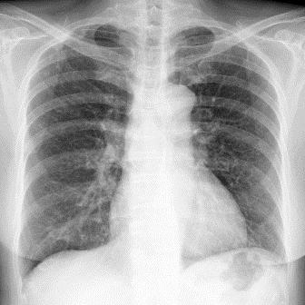</td>
     <td>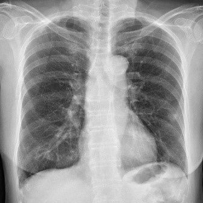</td>
     <td>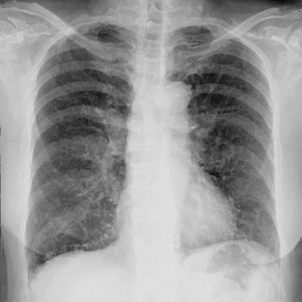</td>
     <td>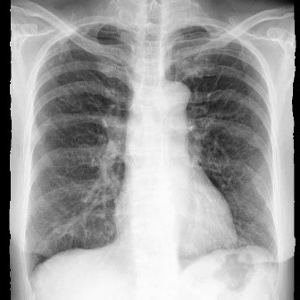</td>
   </tr> 
   <tr align="center" valign="center">
     <td> 25 </td>
     <td>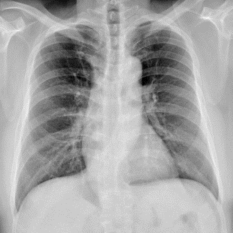</td>
     <td>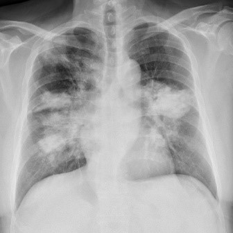</td>
     <td>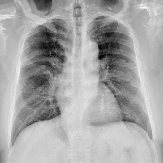</td>
     <td>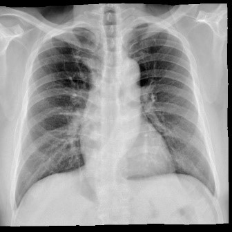</td>
   </tr>
   <tr align="center" valign="center">
     <td> 27 </td>
     <td>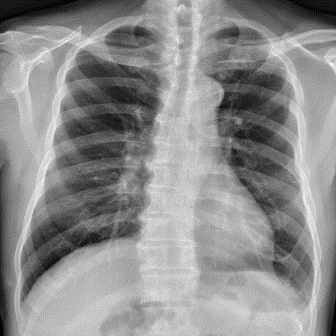</td>
     <td></td>
     <td>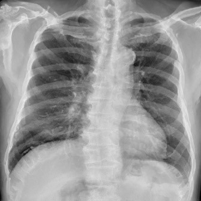</td>
     <td>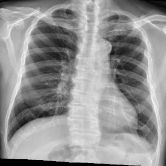</td>
   </tr>
</table>

### Contours

<table>
   <tr align="center" valign="center">
     <td> Patient ID </td>
     <td> SCPD-Net(Ours) </td>
     <td> DisplacementField </td>
   </tr>
   <tr align="center" valign="center">
     <td> 3 </td>
     <td>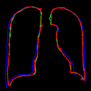</td>
     <td>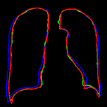</td>
   </tr> 
   <tr align="center" valign="center">
     <td> 25 </td>
     <td>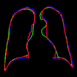</td>
     <td>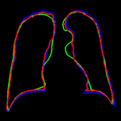</td>
   </tr>
   <tr align="center" valign="center">
     <td> 27 </td>
     <td>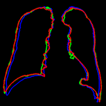</td>
     <td>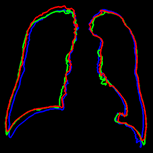</td>
   </tr>
</table>
